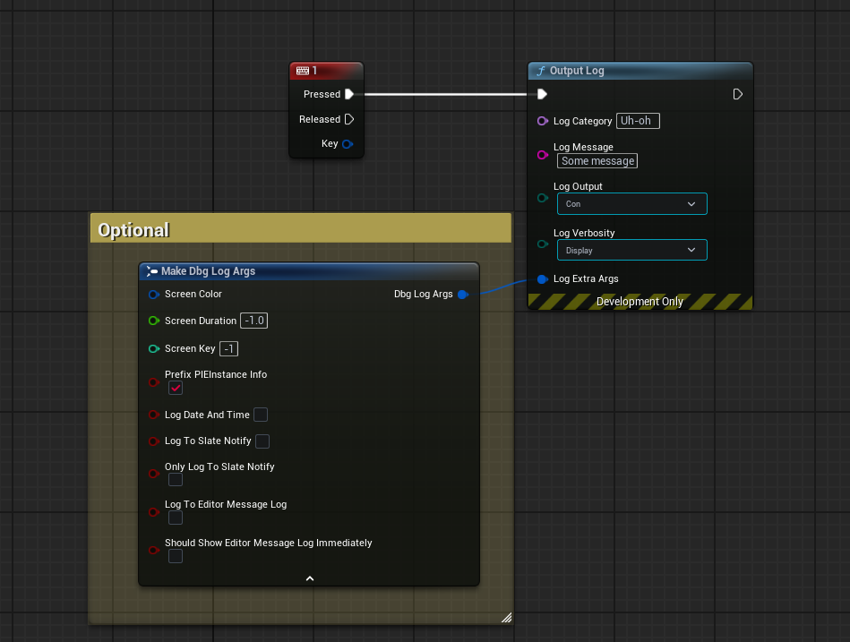

This library is built on top of LLog - https://github.com/landelare/llog and adds some QOL features as well as implementing
the actual macros and Builder pattern for logging (more on this later).

But a HUGE shout out goes to Laura for her work and logging articles https://landelare.github.io/2022/04/28/better-ue_log.html


<br>
Supports Engine Version 5.3.2 and above and requires c++20 (which is default on 5.3 an up).

Supported in both C++ and Blueprints.
<br>


## Steps for installation:
- 1) Download the "dbgLog" folder (either by cloning the repo or downloading the latest release).
- 2) Place folder inside of your module where you wish for the logging macro to exist, typically your main game core module,
	but it also could be some other module like a custom debugging specific module.
- 3) Modify the `Build.cs` file of module holding the folder to define the export API for it, just copy paste this but replace MYMODULE_API with yours, this only needs to be done for the module that holds the folder.
		- `PublicDefinitions.Add("DBG_API=MYMODULE_API");` 
- 4) Ensure any module that uses this macro has "Slate" defined as a dependency, if it doesn't just paste this snippet in that modules `Build.cs`
		-  `PrivateDependencyModuleNames.Add("Slate");`
- 5) That's it, now just include "dbgLog/dbgLog.h" anywhere you wish to use the macro from. You can reorganize the file/folder structure however you see fit but just ensure to update the includes within them.


> Small example of the console output of the log macros in action.
<div style="text-align: center;">
	
</div>

> Also is supported in blueprints.


This library is built off of the standard libraries `std::format` and has better formatting support than unreals standard
FString::Format (which doesn't even let you specify arg placements or decimal places) and is a LOT
safer than Printf formats which crash at runtime by simply passing the wrong % specifier.

std::format will compile-time assert if anything is not correct or would cause a crash.

Please See https://en.cppreference.com/w/cpp/utility/format/spec for a more in-depth look at formatting options
which are supported here, this allows you define floating point precision, spacing etc.


There are really only two macros to concern yourself with -
- `dbgLOG`
- `dbgLOGV`


Side note: You can easily redefine these macros to fit your own projects naming scheme by simply copy pasting this and renaming it to your own preference:
```cpp
#define MYOWNLOG(Msg, ...) dbgLOG(Msg, __VA_ARGS__)
#define MYOWNLOGV(Args, Msg, ...) dbgLOGV(Args, Msg, __VA_ARGS__)
```

There are also some built in console commands such as:
- `dbgLog.DisableCategory [SomeCategory SomeOtherCategory]` Where SomeCategory and SomeOtherCategory are the ones you want to disable.
- `dbgLog.EnableCategory [SomeCategory]` Where SomeCategory is the one you want to re-enable.
- `dbgLog.PrintCategoriesStates` Can be used to print the current state of the categories registered with us.

These are built ON TOP of the existing verbosity system in unreal and are just a nice thing to have for quick enabling/disabling without modifying a logs verbosity directly. 

Now onto explaining the rest.


### Regular Log
dbgLOG is your standard log macro that takes a format message and optional logs, some example usages are as follows:
```cpp
// Outputs: "Regular log"
dbgLOG("Regular log");

// Outputs: "Mr Tim Sweeney"
dbgLOG("Mr Tim {0}", "Sweeney");

// Outputs: "Foo Bar" (see how we can reorder the arguments depending on their placement)
dbgLOG("{1}{0}", "Bar", "Foo");

// Outputs: "Foo Bar 42"
dbgLOG("{1}{0} {2}", "Bar", "Foo", 42);

// Outputs: "3.142" (see how we specify :.3f to output only up to three decimal places)
dbgLOG("{0:.3f}", 3.14159265);

// Outputs: "3.141592653589793238" (The entire value since we didn't specify a precision)
dbgLOG("{0}", 3.141592653589793238);
```


We can also log items such as; TArray, TMap, Tuples, C style arrays, enums, structs, pointers etc.
Containers are recursive and call the same format function for each of their elements within.

You can also add support for your own logging formats based on the type by extending the `if constexpr` chain found inside of `LLog.h` [Here](https://github.com/itsBaffled/dbgLOG/blob/main/dbgLog/Private/LLog.h#L291) with the `FormatArgument` function, this is more hands on and usually isn't required.


Some more examples of logging built in types are as follows:
```cpp
// Outputs: "ESomeEnum::Val_3", if the enum is not using reflection it would just output its value as an int
ESomeEnum SomeEnum = ESomeEnum::Val_3;
dbgLOG("{0}", SomeEnum);


// Outputs: "[0, 1, 2, 3, 4]"
int MyStaticArray[5] = {0, 1, 2, 3, 4};
dbgLOG("{0}", MyStaticArray);


// Outputs: "[5, 6, 7, 8, 9]"
TArray<int> MyDynamicArray = {5, 6, 7, 8, 9};
dbgLOG("{0}", MyDynamicArray);


USTRUCT(BlueprintType)
struct FMyReflectedStruct
{
	GENERATED_BODY()
public:
	UPROPERTY(EditAnywhere)
	FString SomeStr = TEXT("Foo");

	UPROPERTY(EditAnywhere)
	int SomeInt = 42;
	
	UPROPERTY(EditAnywhere)
	float SomeFloat = 3.14f;
};

// This is able to be logged because we make use of Unreal's reflection and log it via ExportText which gives us
// the name and value for each exposed property.
// Outputs: "(SomeStr="Foo",SomeInt=42,SomeFloat=3.14)"
FMyReflectedStruct S{};
dbgLOG("{0}", S);


struct FMyRegularStruct
{
	FString ToString() const {return FString::Format(Text("{0} {1}"), {SomeStr, MyValue}); }
	FString SomeStr = TEXT("Foo");
	int MyValue = 42;
};

// This is able to be logged without reflection needed because the type has a public `ToString` member function which we call, if we didn't have that or a "GetName()"
// then we would not be able to log the type by default and you would need to log it like normal by getting each member that you want out IE; 
// "dbgLOG("MyVal {0}", S.MyValue)"
// Outputs: "Foo 42"
FMyRegularStruct S{};
dbgLOG("{0}", S);


// We can log pointers like so, no need to check for null (that also goes for non uobject pointers):
// Outputs: "UObject Pointer: (UMyObject*)Name"
UMyObject* ThisPointer = this;
dbgLOG("UObject Pointer: {0}", this);

// Outputs: "UObject Pointer: (MyType*)Null Ptr" (Doesn't crash)
ThisPointer = nullptr;
dbgLOG("UObject Pointer: {0}", ThisPointer);


struct FHealth
{
	FString ToString() const {return FString::Format(TEXT("Health: {0}"), {Health});}
	float Health = 95.f;
};

TMap<int, FHealth> SomeStructMap = {
	{0, {95.f}},
	{1, {85.f}},
	{2, {75.f}},
	{3, {65.f}},
	{4, {55.f}}
};

// Outputs: "[ {0, Health: 95}, {1, Health: 85}, {2, Health: 75}, {3, Health: 65}, {4, Health: 55} ]"
dbgLOG("{0}", SomeStructMap);
```


### Verbose Log

`dbgLOGV` is just an extension of `dbgLOG` with the added possibility for builder args, if you are not familiar with this concept it basically
just allows you to chain arguments together, for example ` .ThingOne(Value).ThingTwo(Value).ThingThree(Value)` and it works because each chained
argument just returns a reference to the original builder object.

This style of a log macro allows for basically multiple variadic args (the builder and the format args).

Here are some examples of the verbose macro in use:
```cpp
// Sets this logs verbosity to Warning
dbgLOGV(.Warn(), "Warning log");

// Sets this logs verbosity to Error
dbgLOGV(.Error(), "Error log");


// Here we choose to make this log output to both screen and console (the options are `Console, Screen, ConsoleAndScreen`)
// also note how we chain multiple args. The time we show the message on screen for is defined from the logs verbosity - in this case it is Error so 30s
dbgLOGV(.Error().ScreenAndConsole(), "{0}", 3.14);


// WCO (short for World Context Object) gives us more contextual information for output of the log
// in the format of `[Client | Instance: 0]: My value is - whatever`, where Client could be "Dedicated Server", "Standalone", etc.

// Also we can runtime log with *whatever* category name we want (the only thing of note is we prefix all categories with "dbg" to ensure
// we have no runtime clashes with existing categories set by the engine)
dbgLOGV(.Category("MyCustomCategory").WCO(this), "My value is - {0}", GetSomeValue);

// This is the same as above but this one takes an existing log category that you or the engine has predefined
// so no need to worry about losing your favorite predefined log categories.
dbgLOGV(.Category(LogTemp).WCO(this), "My value is - {0}", GetSomeValue());


// Condition is great for ensuring conditions and branches for logging are not actually kept in shipping builds (this is my favorite)
// One use case is obviously getter/predicate functions like HasAmmo() but you can also do things like ".Condition(MyCvar.GetValueOnGameThread())" 
dbgLOGV(.Condition(false), "I only log if the condition is true");


	
// Spawns a slate notification popup in the bottom right - the verbosity of the log dictates the notify show duration.
dbgLOGV(.LogToSlateNotify(), "My Slate Notify"); // Shows for 6s
dbgLOGV(.LogToSlateNotify().Error(), "My Slate Notify"); // Shows for 30s


// Spawns a message box dialog for the programmer to interact with, also provides a callback for what they chose - you can pass null if you
// do not want to respond to the selected option.
dbgLOGV(.LogToMessageDialog( [](EAppReturnType::Type Result)
{
	dbgLOG( "The user selected {0}", Result);
}, EAppMsgType::YesNo ), "Should Do Thing?" );
```

<br>

 Visual logger and Debug shapes are also supported as Builder args, examples below:
```cpp
 
 // Draws this actor's bounds into the visual logger (the reason for this, this is because
 // it takes the log owner and the actor to draw which can be different in certain circumstances)
 // We can only have one type of visual log per macro though.
dbgLOGV(.VisualLogBounds(this, this), "Visual Log Test {0}", GetWorld()->GetTimeSeconds());


// Many different DrawDebugShape functions are supported to ensure they are
// compiled out of shipping builds and the usage of this library is streamlined
dbgLOGV(.DrawDebugSphere(this, GetActorLocation(), 50.f, 12), "Drawing Sphere...");
 
```


There are many more options to pick from with the dbgLOGV macro, as you type a period in the first param of the macro you will see all the options available to you via intellisense.
- `dbgLOGV(. , "")`


As always, any issues please feel free to reach out to me :)
- [Twitter](https://twitter.com/itsBaffled)
