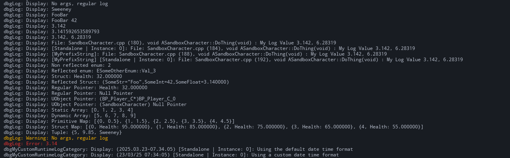

This library is built on top of LLog - https://github.com/landelare/llog and adds some QOL features
(like logging compile-time arrays, not crashing on null pointers and a few other things) as well as implementing
the actual macros and Builder pattern for logging (more on this later). But a HUGE shout out goes
to Laura for her work and logging articles https://landelare.github.io/2022/04/28/better-ue_log.html


Using the library is as simple as copying the `dbgLog` folder into your project and including the header file in your code.



> Small exaple of the console output of the log macros in action


This library is built off of the `std::format` and has better formatting support than standard
FString::Format (which doesn't even let you specify arg placements or decimal places) and is a LOT
safer than Printf formats which crash at runtime by simply passing the wrong % specifier.

Here we compile-time assert if anything is not correct or would cause a crash.
Please See https://en.cppreference.com/w/cpp/utility/format/spec for a more in-depth look at formatting options
which are supported here.


There are really only two macros to concern yourself with - `dbgLOG` and `dbgLOGV`.

---

### Regular log

dbgLOG is your standard `std::format` log macro that takes a format message and optional logs, some example usages are as follows:
```cpp
dbgLOG( "No args, regular log" );												// Outputs: "No args, regular log"
dbgLOG( "Mr Tim {0}", "Sweeney" );											    // Outputs: "Mr Tim Sweeney"
dbgLOG( "{1}{0}", "Bar", "Foo" );												// Outputs: "Foo Bar" (see how we can reorder the arguments depending on their placement)
dbgLOG( "{1}{0} {2}", "Bar", "Foo", 42 );										// Outputs: "Foo Bar 42"
dbgLOG( "{0:.3f}", 3.14159265 );												// Outputs: "3.142" (see how we specify :.3f to output only up to three decimal places)
dbgLOG( "{0}", 3.141592653589793238 );										    // Outputs: "3.141592653589793238" (outputs the entire value)
dbgLOG( "{0:.3f}, {1:.5f}",	3.141592653589793238, 6.283185307179586476 );		// Outputs: "3.142, 6.28319"
```

We can also log containers(such as; TArray, TMap, Tuples, C style arrays), enums, structs, pointers etc in a native fashion. Containers are recursive and call the same format function
for each of their elements
	
```cpp
// Outputs: "Reflected enum: ESomeOtherEnum::Val_3", if the 
// enum is not using reflection it would just output its constant value as an int
ESomeOtherEnum SomeOtherEnum = ESomeOtherEnum::Val_3;
dbgLOG( "Reflected enum: {0}", SomeOtherEnum );				
```

If a struct type has a ToString or GetName function, that will be preferred BUT if it doesn't and the struct *is* reflected
we can still log its contents by falling back to unreals `ExportText` which prints all reflected variables and their values, for example

```cpp
USTRUCT(BlueprintType)
struct FMyReflectedStruct
{
	GENERATED_BODY()
public:
	UPROPERTY(EditAnywhere)
	FString SomeStr = TEXT("Foo");

	UPROPERTY(EditAnywhere)
	int SomeInt = 42;
	
	UPROPERTY(EditAnywhere)
	float SomeFloat = 3.14f;
};

FMyReflectedStruct S{};
dbgLOG( "Reflected Struct: {0}", S );	// Outputs: "Reflected Struct: (SomeStr="Foo",SomeInt=42,SomeFloat=3.14)"
```
If we couldn't find a way to log the type then we get a compile-time error.


<br>

Here are some more examples
```cpp
// Outputs: "UObject Pointer: (MyObject*)Name"
UMyObject* ThisPointer = this;
dbgLOG( "UObject Pointer: {0}", this );				

// Outputs: "UObject Pointer: (MyObject*)Null Ptr", see how null won't crash the program.
ThisPointer = nullptr;
dbgLOG( "UObject Pointer: {0}", ThisPointer );		


// Outputs: "Static sized Array: [0, 1, 2, 3, 4]"
int MyStaticArray[5] = {0, 1, 2, 3, 4};
dbgLOG( "Static sized Array: {0}", MyStaticArray );	


// Outputs: "Dynamic Array: [5, 6, 7, 8, 9]"
TArray<int> MyDynamicArray = {5, 6, 7, 8, 9};
dbgLOG( "Dynamic Array: {0}", MyDynamicArray );		


// Not reflected but we can log it because we defined a ToString
struct FHealth
{
	FString ToString() const {return FString::Format(TEXT("Health: {0}"), {Health}); }
	float Health = 95.f;
};

// Outputs: "Struct: Health: 32" (This uses our custom ToString() function)
FHealth Health{32.f};
dbgLOG( "Struct: {0}", Health );	

// Outputs: "Struct: Health: 32"
FHealth* HealthPtr = &Health;
dbgLOG( "Regular Pointer: {0}", HealthPtr );							
	
// Outputs: "Null Pointer: "
HealthPtr = nullptr;
dbgLOG( "Regular Pointer: {0}", HealthPtr );							

TMap<int, FHealth> SomeStructMap = {
	{0, {95.f}},
	{1, {85.f}},
	{2, {75.f}},
	{3, {65.f}},
	{4, {55.f}}
};

// Outputs: "Struct Map: [ {0, Health: 95}, {1, Health: 85}, {2, Health: 75}, {3, Health: 65}, {4, Health: 55} ]"
dbgLOG( "Struct Map: {0}", SomeStructMap );			
```


---
<br>

### Verbose log 

`dbgLOGV` is just an extension of `dbgLOG` with the added possibility for builder args, if you are not familiar with this concept it basically
just allows you to chain arguments together, for example ` .ThingOne(Value).ThingTwo(Value).ThingThree(Value)` and it works because each chained
argument just returns a reference to the original builder object.

This style of a log macro allows for basically multiple variadic args (the builder and the format args).

Here is a simple example of how we set the verbosity of our log
dbgLOGV( .Verbosity( ELogVerbosity::Warning ), "No args, regular log");


```cpp
// Here we choose to make this log output to both screen and console 
// (the options are `Con, Scr, Both`) Note how we chain multiple args
dbgLOGV( .Verbosity( ELogVerbosity::Error ).Output( Both ),
		"{0}", 3.14 );
```


```cpp
//WCO gives more contextual information in the output in the format of `[Client | Instance: 0]: My value is - whatever`
//where Client could be "Dedicated Server", "Standalone", etc.

//Also we can runtime log with *whatever* category name we want (the only thing of note is we prefix all categories with "dbg" to ensure
//we have no runtime clashes with existing categories set by the engine)

dbgLOGV( .Category( "MyCustomCategory" ).WCO( this ),
	"My value is - {0}", GetSomeValue);
```


```cpp
// `Condition` is great for ensuring conditions and branches for logging are not actually kept in shipping builds (this is my favorite)
`dbgLOGV( .Condition( false ), "I only log if the condition is true {0}", GetWorld()->GetTimeSeconds() );`

```

```cpp
// Using a completely different runtime category here and showing how we can
// not only log the date and time but also control how it's presented in the log
	dbgLOGV( .Category( "MyCustomRuntimeLogCategory" ).WCO( this )
			 .LogDateAndTime(TEXT("%d/%m/%y %H:%M:%S")),
			 "Using a custom date time format" );
```


Visual logger and Debug shapes are also supported as Builder args, examples below:

```cpp
// Draws this actor's bounds into the visual logger (the reason for this, this is because
// it takes the log owner and the actor to draw which can be different in certain circumstances)
// We can only have one type of visual log per macro though.

dbgLOGV( .VisualLogBounds( this, this ),
	"Visual Log Test {0}", GetWorld()->GetTimeSeconds());
```


```cpp
// Many different DrawDebugShape functions are supported to ensure they 
// are compiled out of shipping builds and the usage of this library is streamlined
dbgLOGV( .DrawDebugSphere( this, GetActorLocation(), 50.f, 12 ), "Drawing Sphere...");
```

There are many more options to pick from with the dbgLOGV macro, as you type `.` in the first param of the macro you will see all the options available to you via intellisense.


As always, any issues please feel free to reach out to me :)
- [Twitter](https://twitter.com/itsBaffled)